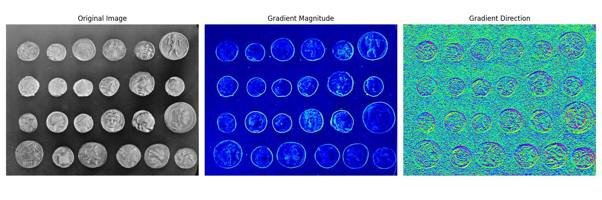
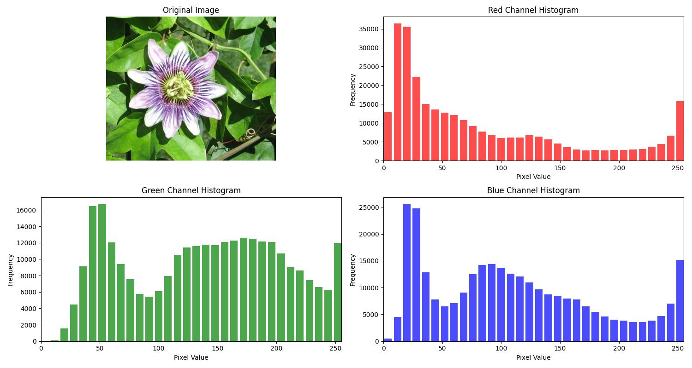
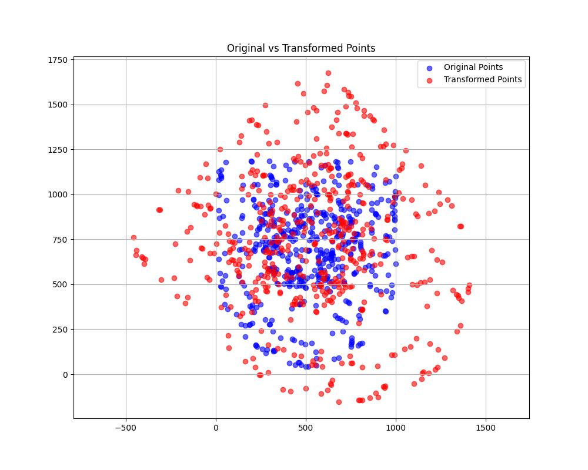
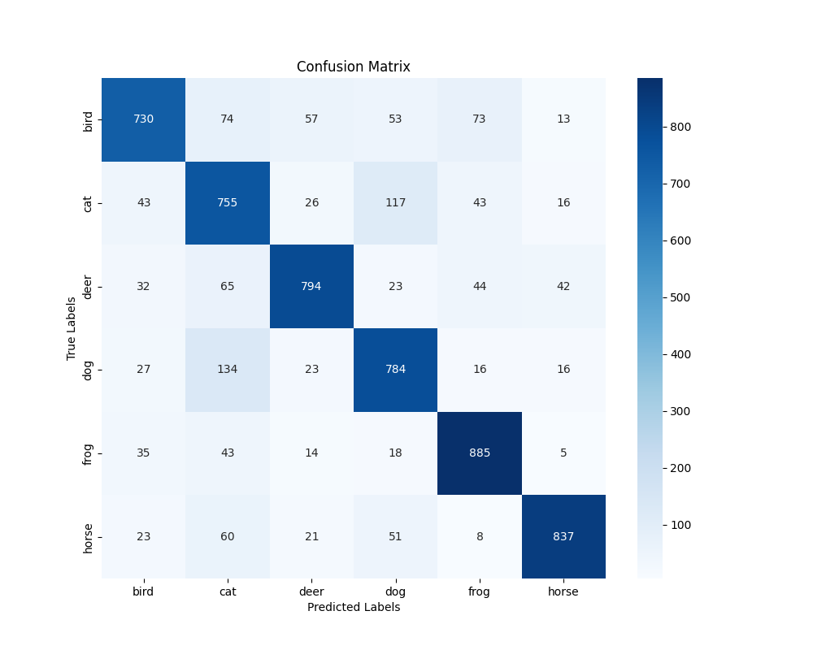

<p align="center">
  
  
  
  
</p>

<p align="center">
  <em>
    From left to right: Edge detection, Color histogram, Affine transformation, ResNet confusion matrix
  </em>
</p>


# vision-project
# Multi-Task Computer Vision System (Course Project, ECMM426)

This repository contains a comprehensive computer vision pipeline developed as part of the ECMM426 Computer Vision assessment at the University of Exeter. The project includes traditional image processing, deep learning classification, and object detection tasks.

* Final Grade: 96/100

---

##  Project Tasks Overview

| Task | Description |
|------|-------------|
| **Q1** | Compute image gradient magnitude and direction using Sobel filters |
| **Q2** | Generate RGB histograms of a color image with 32-bin resolution |
| **Q3** | Apply affine transformation on point clouds with matrix multiplication |
| **Q4** | Train a lightweight ResNet on CIFAR-10 animal classes |
| **Q5** | Evaluate model performance and visualize confusion matrix |
| **Q6** | Detect masked face counts using object detection (Faster R-CNN) |

---

##  Tech Stack

- `Python`
- `PyTorch` (CNN training & model evaluation)
- `OpenCV`, `NumPy` (image processing)
- `Matplotlib`, `Seaborn` (visualizations)
- `ResNet`, `Faster R-CNN` (deep models)

---

##  Repository Structure

```text
vision-project/
├── Q1.py                        – Gradient estimation
├── Q2.py                        – Color histogram computation
├── Q3.py                        – Affine transformation
├── Q4.py                        – CNN (ResNet) training on CIFAR-10
├── Q5.py                        – Test + confusion matrix
├── Q6.py                        – Masked face detection & count
├── ca_utils.py                  – Custom ResNet module
├── data/                        – Input images & datasets
│   ├── coins.jpg, flower.jpg
│   ├── cifar-10-python.tar.gz   (official)
│   └── weights_resnet.pth, weights_counting.pth
├── *.npy                        – Preprocessed data arrays
├── *.jpg/png                    – Output visualizations
├── Report.docx                  – Full coursework report
└── README.md

---

##  Results Summary

- **CIFAR-10 Animal Classification**:
  - Accuracy: `79.75%`
  - Confusion matrix: see `confusion_matrix.png`
- **Masked Face Counting**:
  - Evaluation Metric: `MAPE = 15.89%`
  - Detection model: `Faster R-CNN` with custom label counts

---

##  How to Run (example)

```bash
# Q1: Compute gradient
python Q1.py

# Q4: Train CNN
python Q4.py  # Saves weights to weights_resnet.pth

# Q6: Object detection
python Q6.py  # Uses pre-trained Faster R-CNN

‘’

‘’

Author：
Zhenwei Song
University of Exeter
MSc Computer Science 
